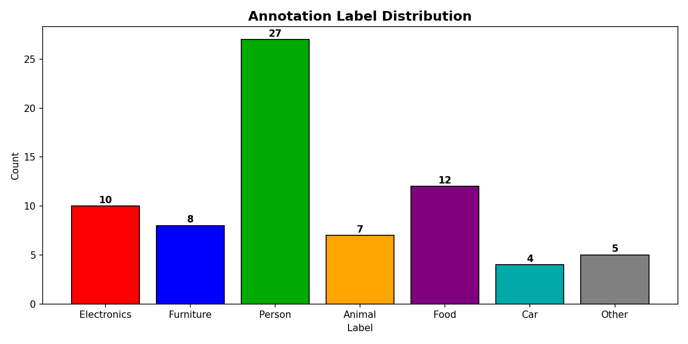
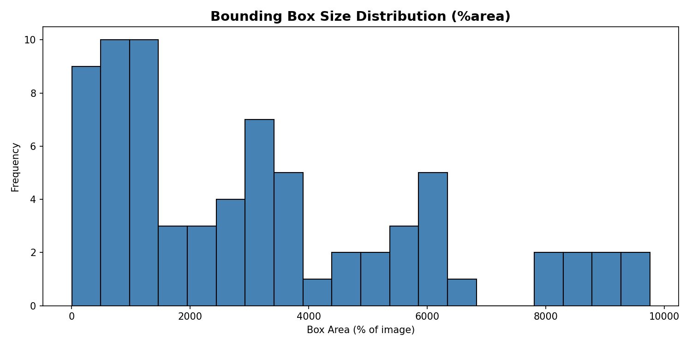
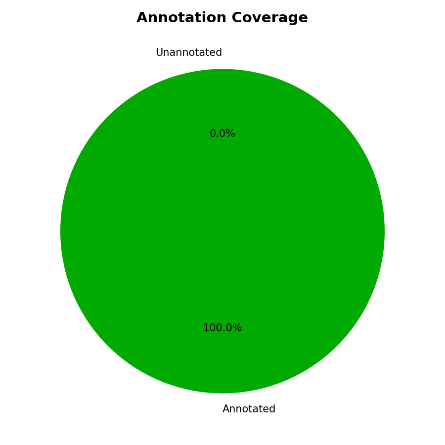

# Image Annotation Project

An end-to-end image annotation pipeline built using Label Studio and Python.

## Project Overview
- Annotated **45 real-world images** with bounding boxes using Label Studio
- Drew **73 bounding boxes** across 7 object categories
- Built a Python QC Analysis Pipeline to validate annotation quality

## Tools & Technologies
- **Label Studio** – annotation tool
- **Python** – analysis scripting
- **OpenCV** – image processing
- **Matplotlib** – data visualization

## Label Distribution
| Label | Count |
|-------|-------|
| Person | 27 |
| Food | 12 |
| Electronics | 10 |
| Furniture | 8 |
| Animal | 7 |
| Other | 5 |
| Car | 4 |

## QC Analysis Pipeline
- Detected tiny/erroneous bounding boxes automatically
- Flagged crowded images with too many annotations
- Generated visual reports: label distribution, box size distribution, annotation coverage

## Output Charts




## Project Structure
```
image-annotation-project/
├── data/
│   └── annotations/
├── scripts/
│   ├── download_dataset.py
│   ├── create_import.py
│   ├── cors_server.py
│   └── analyze_annotations.py
├── output/
└── README.md
```
